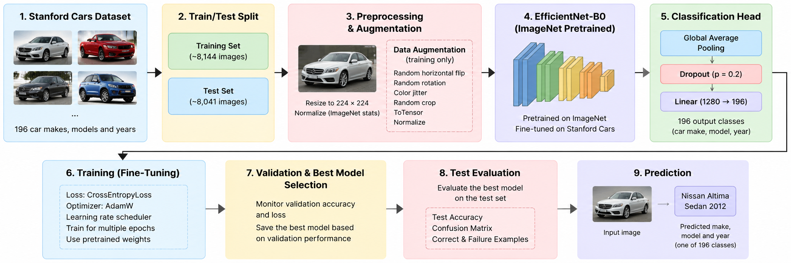
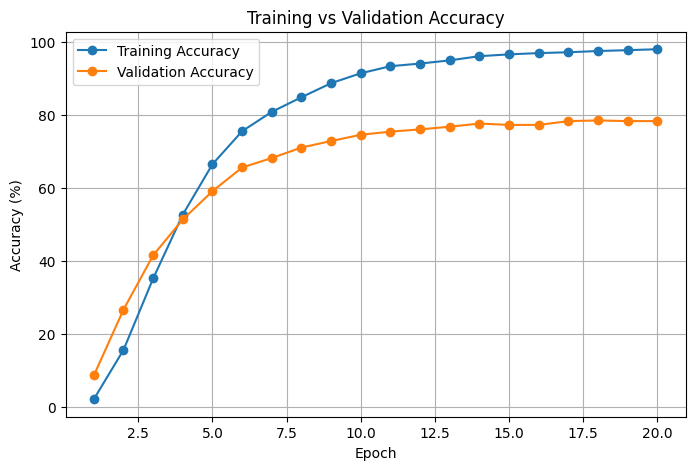
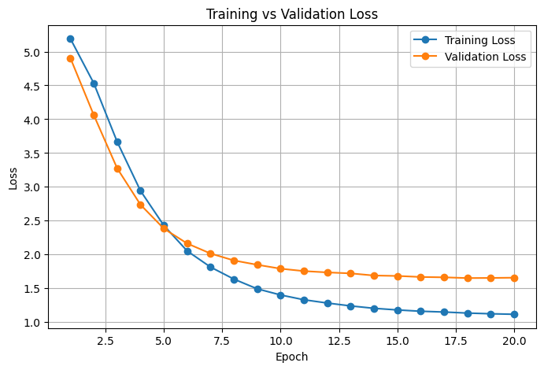
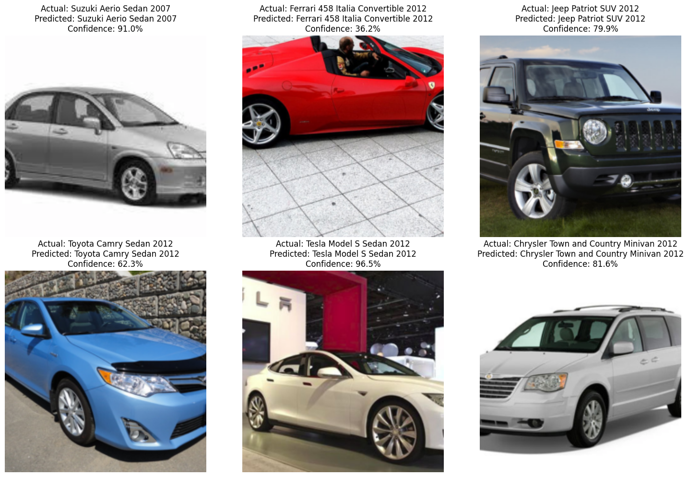
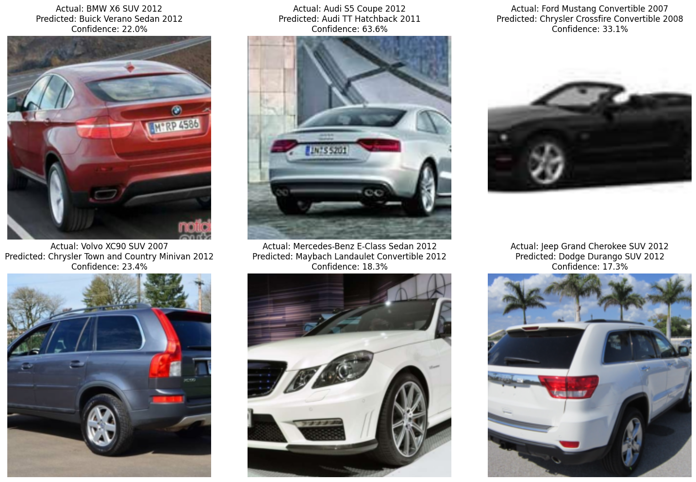

# 🚗 Car Make and Model Recognition Using EfficientNet-B0

A deep learning computer vision project for **fine-grained car classification** using **EfficientNet-B0** and transfer learning on the **Stanford Cars dataset**.

The system takes an image of a car as input and predicts its specific **make, model, and year** from 196 vehicle classes.

---

## 📌 Project Overview

Recognizing specific car models is a challenging computer vision problem because many vehicles have very similar visual characteristics.

This project develops an image classification system capable of distinguishing between **196 different car classes** using a pretrained EfficientNet-B0 convolutional neural network.

Instead of training a model from scratch, **transfer learning** is used by starting with EfficientNet-B0 weights pretrained on ImageNet. The network is then fine-tuned on the Stanford Cars dataset.

The complete pipeline includes:

- Dataset exploration
- Train/validation/test preparation
- Image preprocessing
- Data augmentation
- Transfer learning with EfficientNet-B0
- Model fine-tuning
- Validation-based model selection
- Test-set evaluation
- Confusion matrix analysis
- Successful and failed prediction analysis


---

## 🎯 Problem Definition

### Problem

The objective is to classify an input image of a car into its correct **make, model, and year**.

This is a **fine-grained image classification** problem. Different vehicle classes may have very similar shapes, headlights, grills, body structures, and other visual features, making classification more difficult than general object recognition.

### Input

An RGB image containing a car.

### Output

One predicted class representing the vehicle's:

**Make + Model + Year**

The model selects from **196 possible car classes**.

### Potential Applications

The system could potentially be applied to:

- Vehicle inventory management
- Automotive image search
- Intelligent transportation systems
- Parking and vehicle monitoring
- Automated vehicle recognition applications

---

## 📊 Dataset

This project uses the **Stanford Cars dataset**, a dataset designed for fine-grained vehicle classification.

### Dataset Information

| Property | Description |
|---|---|
| Number of classes | 196 |
| Original training images | Approximately 8,144 |
| Original test images | Approximately 8,000 |
| Image type | RGB car images |
| Classification task | Make, model, and year |

The original training data is further divided into **training and validation sets** using a stratified split.

The three subsets are used as follows:

- **Training set** — used to update the model parameters.
- **Validation set** — used to monitor generalization and select the best model.
- **Test set** — used only for final evaluation.

The dataset is loaded programmatically in the notebook using the Hugging Face `datasets` library.

---

## 🧠 Model

### EfficientNet-B0

The model selected for this project is **EfficientNet-B0**.

EfficientNet-B0 provides a good balance between classification performance and computational efficiency, making it suitable for fine-tuning in Google Colab.

### Transfer Learning

The model is initialized using weights pretrained on **ImageNet**.

These pretrained weights provide useful visual representations for features such as:

- Edges
- Shapes
- Textures
- Object structures

The complete network is then fine-tuned on the Stanford Cars dataset.

### Classifier Modification

The original EfficientNet-B0 classifier is designed for the 1,000 ImageNet classes.

For this project, the final classification layer is replaced with:

```text
Dropout(p=0.2)
Linear(in_features=1280, out_features=196)
```

This allows the model to produce predictions for the **196 Stanford Cars classes**.

---

## 🖼️ Data Preprocessing and Augmentation

The input images are prepared for EfficientNet-B0 using PyTorch transformations.

### Training Images

The following transformations are applied:

- Random resized crop to `224 × 224`
- Random horizontal flip
- Random rotation
- Color jitter
- Conversion to PyTorch tensor
- ImageNet normalization

Data augmentation increases variation in the training images and helps improve model generalization.

### Validation and Test Images

Validation and test images use deterministic preprocessing:

- Resize
- Center crop to `224 × 224`
- Convert to tensor
- ImageNet normalization

Random augmentation is not applied to the validation or test sets so that evaluation remains consistent.

---

## ⚙️ Training Configuration

The model is fine-tuned using the following configuration:

| Parameter | Configuration |
|---|---|
| Architecture | EfficientNet-B0 |
| Pretrained weights | ImageNet |
| Number of classes | 196 |
| Input resolution | 224 × 224 |
| Batch size | 32 |
| Optimizer | AdamW |
| Learning rate | 0.0001 |
| Weight decay | 0.0001 |
| Loss function | Cross-Entropy Loss |
| Label smoothing | 0.1 |
| LR scheduler | Cosine Annealing |
| Fine-tuning | All model layers |
| Model selection | Best validation accuracy |

The best model checkpoint is saved according to **validation accuracy** rather than simply using the final training epoch.

---

## 🔄 Project Workflow

The overall computer vision pipeline is:

```text
Stanford Cars Dataset
        │
        ▼
Train / Validation / Test Data
        │
        ▼
Image Preprocessing & Augmentation
        │
        ▼
EfficientNet-B0
(ImageNet Pretrained)
        │
        ▼
Replace Final Classifier
1,000 → 196 Classes
        │
        ▼
Fine-Tuning
AdamW + Cross-Entropy Loss
        │
        ▼
Validation
        │
        ▼
Best Model Selection
        │
        ▼
Test Set Evaluation
        │
        ▼
Accuracy / Precision / Recall / F1-Score
        │
        ▼
Car Make + Model + Year Prediction
```

A graphical workflow diagram will also be included in the `images/` directory.

---

## 📈 Results

The best EfficientNet-B0 checkpoint was obtained at **epoch 18**.

### Final Model Performance

| Metric | Result |
|---|---:|
| Best Epoch | **18** |
| Training Accuracy | **97.54%** |
| Validation Accuracy | **78.51%** |
| Validation Loss | **1.6516** |
| Test Accuracy | **78.52%** |
| Test Loss | **1.6486** |
| Macro Precision | **79.33%** |
| Macro Recall | **78.48%** |
| Macro F1-Score | **78.50%** |

The validation accuracy of **78.51%** and test accuracy of **78.52%** are nearly identical, showing consistent performance between the validation and independent test sets.

The higher training accuracy of **97.54%** compared with validation and test accuracy indicates a generalization gap and suggests some degree of overfitting.

However, selecting the best checkpoint according to validation performance helps avoid selecting the model solely based on its training performance.

---

## 📉 Training and Validation Performance

Training and validation accuracy and loss were monitored throughout fine-tuning.

The model showed:

- Increasing training accuracy
- Increasing validation accuracy
- Decreasing training loss
- Decreasing validation loss during the main learning stage
- A gap between training and validation performance

The best model was selected at epoch 18 based on validation accuracy.

### Accuracy



### Loss



---

## 🔍 Model Evaluation

The final model is evaluated on the independent test dataset using several metrics.

### Accuracy

Measures the percentage of test images classified into the correct car class.

**Test Accuracy: 78.52%**

### Precision

Measures how often predictions made for a class are correct.

**Macro Precision: 79.33%**

### Recall

Measures how successfully the model identifies images belonging to each class.

**Macro Recall: 78.48%**

### F1-Score

Combines precision and recall into a single balanced metric.

**Macro F1-Score: 78.50%**

Macro averaging is used so that each of the **196 vehicle classes contributes equally** to the final precision, recall, and F1-score.

---

## 🔢 Confusion Matrix

A confusion matrix is used to analyze the relationship between predicted and actual vehicle classes.

Values along the main diagonal represent correct predictions, while values outside the diagonal represent misclassifications.

Because the dataset contains **196 classes**, the complete confusion matrix contains `196 × 196` cells.

The strong diagonal pattern represents correctly classified images, while off-diagonal values show cases where the model confused one vehicle class with another.

---

## ✅ Successful Predictions

Correctly classified test images are examined to understand cases where the model successfully identifies the vehicle.

Each example displays:

- Actual class
- Predicted class
- Prediction confidence



---

## ❌ Failure Cases

Incorrect predictions are also examined to understand the limitations of the model.

Because Stanford Cars is a fine-grained classification dataset, visually similar vehicles can be difficult to distinguish.

Possible causes of incorrect predictions include:

- Similar body designs between models
- Similar vehicles from different model years
- Viewing angle
- Lighting conditions
- Background differences
- Small visual differences between classes



---

## 📁 Project Structure

```text
stanford-cars-efficientnet-classification/
│
├── README.md
├── requirements.txt
├── .gitignore
│
├── notebooks/
│   └── Stanford_Cars_EfficientNetB0.ipynb
│
├── images/
│   ├── workflow_diagram.png
│   ├── training_validation_accuracy.png
│   ├── training_validation_loss.png
│   ├── confusion_matrix.png
│   ├── correct_predictions.png
│   └── failure_predictions.png
│
└── models/
    └── README.md
```

---

## 💻 Technologies Used

- Python
- PyTorch
- TorchVision
- EfficientNet-B0
- Hugging Face Datasets
- Google Colab
- NumPy
- Pandas
- Matplotlib
- Scikit-learn
- Pillow

---

## 🚀 How to Run the Project

### 1. Clone the repository

```bash
git clone <https://github.com/MariamHasan7/stanford-cars-efficientnet-classification.git>
```

Then enter the project directory:

```bash
cd stanford-cars-efficientnet-classification
```

### 2. Install the required libraries

```bash
pip install -r requirements.txt
```

### 3. Open the notebook

The main implementation is available at:

```text
notebooks/Stanford_Cars_EfficientNetB0.ipynb
```

The notebook can be opened and executed using **Google Colab** or a compatible Jupyter environment.

### 4. Run the notebook

Run the cells in order.

The notebook handles:

1. Dataset loading
2. Dataset exploration
3. Train/validation/test preparation
4. Image preprocessing and augmentation
5. EfficientNet-B0 initialization
6. Transfer learning and fine-tuning
7. Model validation
8. Best checkpoint selection
9. Test evaluation
10. Prediction and error analysis

---

## 💾 Model Checkpoint

The trained PyTorch model checkpoint is not included directly in the repository.

The best model can be reproduced by running the training notebook. During training, the checkpoint with the highest validation accuracy is saved automatically.

The checkpoint filename used by the notebook is:

```text
efficientnet_b0_stanford_cars_best.pth
```

---

## 🌐 Real-World Application

The trained model could be integrated into a vehicle recognition application.

A possible deployment pipeline would be:

```text
Car Image
    ↓
Image Preprocessing
    ↓
Trained EfficientNet-B0
    ↓
Class Probabilities
    ↓
Predicted Make / Model / Year
```

Potential deployment options include web applications, vehicle inventory systems, automotive search tools, and intelligent transportation applications.

For more efficient deployment, future work could include converting the PyTorch model to **ONNX** or applying model quantization.

---

## 🔮 Future Improvements

Several improvements could be investigated:

- Use higher-resolution input images to capture finer vehicle details.
- Experiment with additional data augmentation strategies.
- Perform more extensive hyperparameter tuning.
- Test larger EfficientNet variants such as EfficientNet-B1, B2, or B3.
- Compare EfficientNet with architectures such as ConvNeXt or Vision Transformers.
- Apply different learning rates to the pretrained backbone and classification layer.
- Add more real-world vehicle images to improve generalization.
- Investigate techniques for reducing the training-validation performance gap.
- Deploy the trained model through a simple web interface.
- Experiment with ONNX conversion or model quantization.

---

## 📝 Conclusion

This project demonstrates a complete deep learning pipeline for **fine-grained car make and model recognition**.

A pretrained EfficientNet-B0 model was adapted to classify **196 vehicle classes** from the Stanford Cars dataset. Transfer learning and full-model fine-tuning were combined with image preprocessing, data augmentation, validation-based model selection, and independent test evaluation.

The final model achieved a **78.52% test accuracy**, with macro precision, recall, and F1-score of approximately **79%**, demonstrating the effectiveness of transfer learning for fine-grained vehicle classification.

The project also highlights the difficulty of distinguishing visually similar vehicle models and identifies several opportunities for improving generalization in future work.

---

## 👤 Author

**Mariam Hasan**

Computer Vision Systems Development – Final Project
